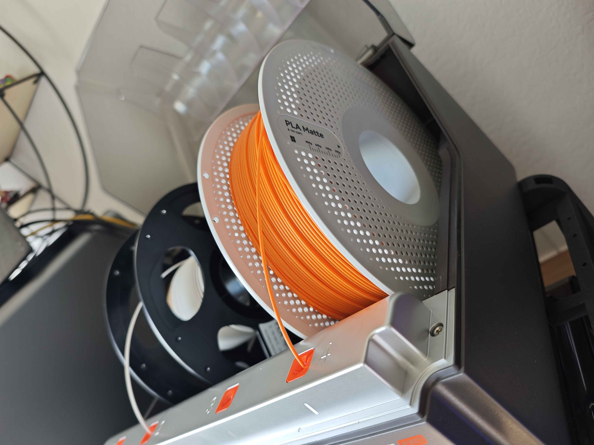
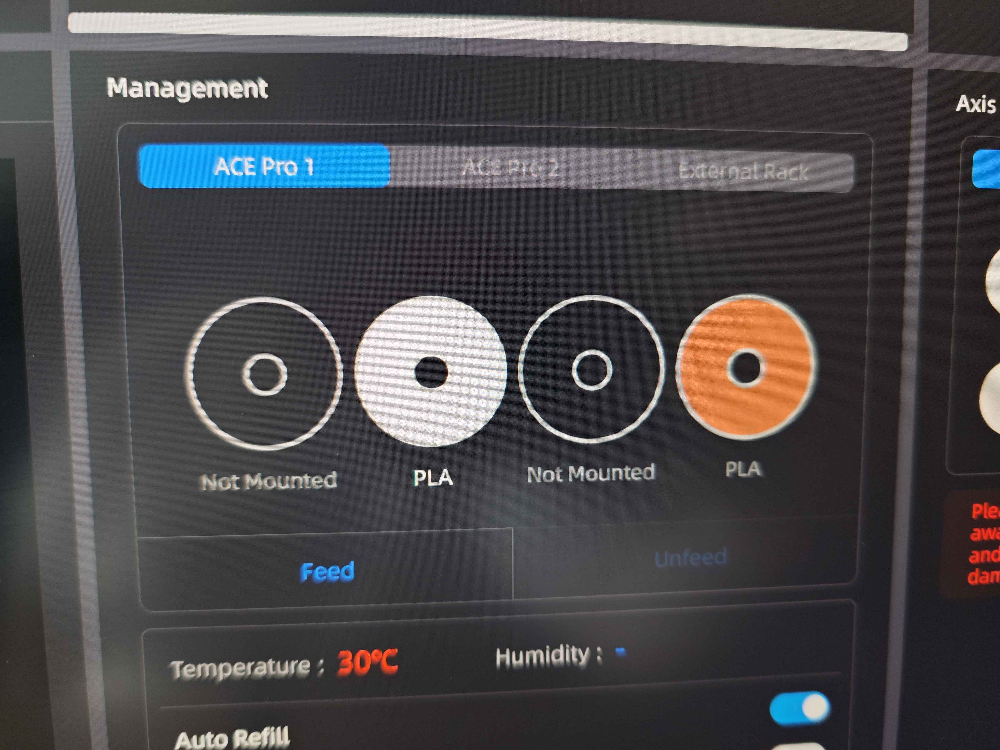

# OpenCubic — ACE Gen 1 Custom Firmware

Custom firmware (CFW) for the **Anycubic ACE Gen 1** filament management system (GD32F303, FreeRTOS).

> **Download the latest firmware:** See [Releases](https://github.com/Jupsi/OpenCubic/releases)  
> Latest: **CFW v1.0** (based on official v1.3.863)

---

## ⚠️ Warnings

### DO NOT flash onto ACE Gen 2

**This firmware is for ACE Gen 1 only.**  
Flashing it onto an ACE Gen 2 unit **will soft-brick the device**. The printer does not prevent you from doing this, so it is your responsibility to check which ACE generation you own before flashing.

Whether a soft-bricked ACE Gen 2 can be recovered without a hardware flash programmer is unknown.

The flash tool blocks flashing when an AVATA-stack printer (Kobra X, Kobra 4) is connected, as those printers only support ACE Gen 2 units. This is an additional safeguard, not a substitute for checking your hardware.

### Use at your own risk

Flashing custom firmware modifies your device. **I take no responsibility for any damage, data loss, or malfunction** resulting from using this firmware or flash tool. You flash at your own risk.

### Restoring original firmware

The original Anycubic ACE firmware binaries are stored in [`originalFirmware/`](originalFirmware/).  
You can restore them at any time using the same flash tool.

---

## Features

- **Multi-vendor NFC** — reads filament spools from multiple brands automatically
- **Improved NFC reliability** — RxGain +15 dB, chip-type-aware stop strategy

| ACE with Bambu & Anycubic spools | Slicer showing recognized spools |
|:---:|:---:|
|  |  |

### Supported NFC Spools

Full details: [docs/supported-spools.md](docs/supported-spools.md)

| Brand | Status |
|---|---|
| Anycubic Gen 1 | ✅ Confirmed |
| Anycubic Gen 2 | ✅ Confirmed |
| Bambu Lab | ✅ Confirmed |
| Elegoo | ✅ Implemented / untested |
| TigerTag | ✅ Implemented / untested |
| OpenSpool | ✅ Implemented / untested |
| OpenPrintTag (Prusa) | ✅ Implemented / untested |
| QIDI | 🔄 Unknown AES keys |
| Creality | 🔄 Unknown AES keys |

---

## Flash Tool

This repo contains the **ACE Flash Tool** — a Qt desktop application to flash the firmware over your local network (MQTT via your Kobra printer).

→ See [docs/how-to-flash.md](docs/how-to-flash.md)

### Build the Flash Tool

Requirements: Qt 5.15+, CMake 3.20+, MSVC 2019/2022

```bash
cd flashtool
cmake -S . -B build -DCMAKE_BUILD_TYPE=Release
cmake --build build
```

The CMakeLists.txt defaults to `E:/Qt/5.15.2/msvc2019_64` for Qt and
`E:/Qt/Tools/QtCreator/bin` for the OpenSSL DLLs. Override if your paths differ:

```bash
cmake -S . -B build \
  -DCMAKE_PREFIX_PATH="C:/Qt/5.15.2/msvc2019_64" \
  -DOPENSSL_SRC="C:/Qt/Tools/QtCreator/bin"
```

---

## Firmware Source

The firmware source code is maintained privately. Compiled release binaries are provided here.

Some parts of the underlying platform and communication protocols are proprietary and
undocumented. The source is therefore not publicly distributed at this time.

---

## Support

If you find this project useful and want to help cover the cost of filament spools from
more brands for NFC testing and implementation — donations are always welcome, never expected.

[](https://ko-fi.com/jupsi)

---

## License

Flash tool: MIT  
Firmware binaries: provided as-is, use at your own risk
